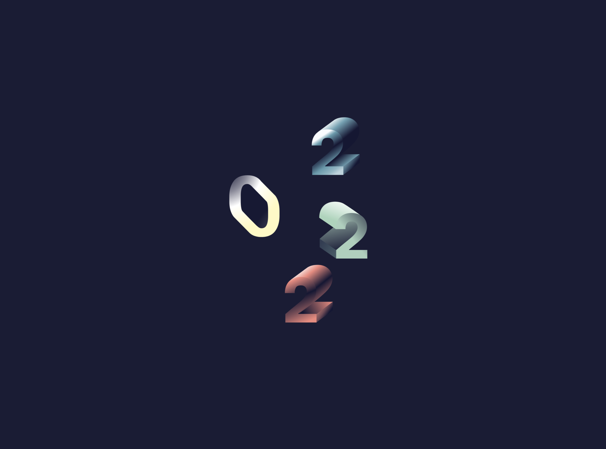

# Zelda - Meilleurs voeux 2022 (React + React Lottie + TSParticles + Framer Motion)

Carte de voeux (numérique) pour souhaiter la bonne année à destination des clients de Zelda Communication.
- mise en place d'un preloader/svg animé (réalisé par Yann) et utlisation de la bibliothèque React Lottie
- utilisation et personnalisation de la bibliothèque "tsparticles" pour créer le background dynamique
- utilisation de la bibliothèque "framer motion" afin de gérer les transitions et l'apparition des composants
- création de plusieurs composants (cf. "Loader", "Cards", "Modal") afin de ne pas surcharger les pages
- création de tableaux d'objets
- utilisation de différents hooks React (useState, useEffect) ainsi que de PropTypes
- ajout d'un favicon personnalisé
- gestion du responsive mobile, tablette et grand écran
- utilisation de scss et minification du fichier style
- build du projet et mise en ligne via FTP

## 🚀 Installation

1. git clone ou télécharger le projet
2. à la racine du projet:
- **npm i** pour installer les dépendances (nodes modules)
- **npm start** pour lancer le projet

## 💫 Live

[https://2022.zelda.fr/](https://2022.zelda.fr/)